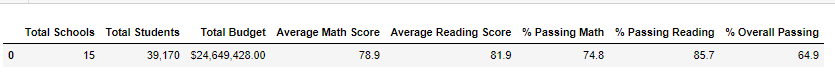
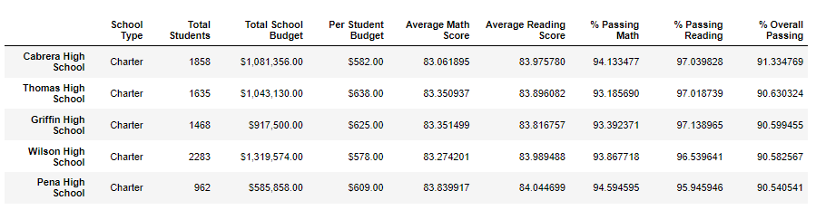
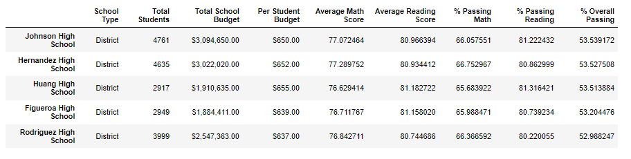
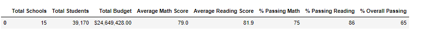
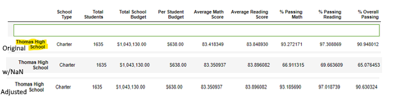

# School District Analysis 
## Project Overview 
After reporting a school district analysis, it was determined that the 9th grade reading and math scores at Thomas High School should be dropped due to academic dishonesty. I’ve been tasked with dropping those scores and repeating the school district analysis including seven key metrics listed below.
1.	Total district budget
2.	Total of student in district
3.	Average math score
4.	Average reading score
5.	Total percentage of students passing math 
6.	Total percentage of students reading
7.	Total percentage of students passing math and reading

## Resources
•	Data Sources: students_complete.csv, schools_complete.csv

•	Software: Python 3.7.10, Anaconda 4.10.3, Juypter Notebook 6.3.0

## Results
The analysis of the district reveals that:
- The total district budget is $24,649,426.00.
- The total number of students in the district is 39,170.
- After replacing the 9th grade scores of Thomas High School, the metrics for the district were (Image 1):
1.	An average math score of 78.9.
2.	An average reading score of 81.9.
3.	A total of 74.8% of students passed math. 
4.	A total of 85.7% of students passed reading.
5.	A total of 64.9% of students passed both math and reading.

**Image 1**
-	The top 5 performing schools are:

1.	Cabrera High School with 91.33% of students passing overall.
2.	Thomas High School with 90.63% of students passing overall.
3.	Griffin High School with 90.60% of students passing overall.
4.	Wilson High School with 90.58% of students passing overall.
5.	Pena High School with 90.54% of students passing overall.

**Top Performing Schools**

- The bottom 5 schools are:
1. Johnson High School with 53.54% of students passing overall.
2. Hernandez High School with 53.53% of students passing overall
3. Huang High School with 53.51% of students passing overall.
4. Figueroa High School with 53.20% of students passing overall.
5. Rodrigues High School with 53.00% of students passing overall.

**Bottom Performing Schools**

**How is the district summary affected?**

**Image 2**

Dropping the 9th grade scores from Thomas High School did not affect the overall district summary when comparing image one and two. This was expected given that those scores accounted for about 1/60 or about 1.67% of the total scores in the school district. However, dropping the 9th grade scores or replacing the scores impacts the performance of Thomas High School differently. 
**How is the school summary affected?**
Before replacing the 9th grade scores with NaN, was ranked as number two in overall school performance when compared to the other schools in the district. After replacing the 9th grade scores with NaN the performance of Thomas High dropped significantly by almost 25% for both percent passing reading, math, and overall while the average remained relatively the same. This is depicted in the first two rows of image 3 below.

**Image 3**

Thomas High is no longer in the top 5 performing schools. This isn’t an accurate depiction of the data since 9th grade scores were replaced without values, but the total student count included 9th grade students skewing the percent passing scores. Once Thomas High student count was updated to reflect only 10th through 12th grade the overall performance of the was ranked second to best.

**How does replacing the ninth graders’ math and reading scores affect Thomas High School’s performance relative to the other schools?**

• Replacing the 9th grade scores only affected the 9th grade scores at Thomas. These values were depicted as NaNs while other grades’ scores remained the same. Before adjusting THS student count, THS was ranked as #2 top performing schools but dropped significantly with only 65% passing. Once the student count was adjusted there was:
  - a decrease of students passing overall 90.94% -----> 90.63%
  - a decrease of students passing reading 97.31%-----> 97.02%
  - a decrease of students passing math 93.27%-----> 93.19%

•	The average math score dropped about 1% but there were no significant changes to percent of students passing reading, math, and overall.
•	The average score and percentage of students passing by school size nor school type changed. 

## Summary
After replacing the 9th grade students with NaN and recalculating the total student count for THS, there was effectively no real changes in the overall school district summary besides the average math score of about 1%. Replacing the 9th grade scores at Thomas did change Thomas’s summary dramatically as seen in image 3 but after adjusting to use only 10th through 12th grade scores Thomas only showed a slight drop as seen in image 3 "adjusted" row.  
